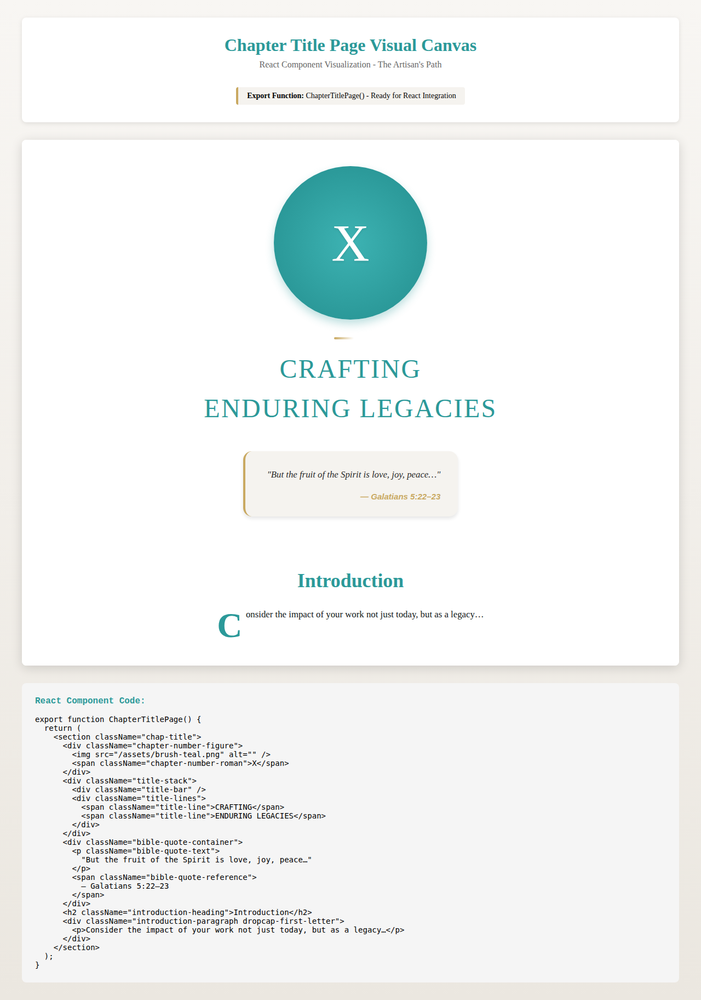

# Chapter Title Page Component - Quick Start Guide

## 🚀 Instant Demo (30 seconds)

```bash
# 1. Clone/Navigate to the repository
cd /home/runner/work/Fm/Fm

# 2. Start local server
python3 -m http.server 8000

# 3. Open in browser
# Visit: http://localhost:8000/chapter-title-page-canvas.html
```

**Or use npm script:**
```bash
npm run canvas:chapter-title
```

## 📦 What You Get

A fully functional React component that displays a chapter title page with:
- ✨ Chapter number emblem (Roman numeral X)
- 📚 Stacked title design
- 📖 Scripture quote container
- ✍️ Introduction with drop cap

## 🎯 Quick Integration

### Option 1: React Component
```jsx
import { ChapterTitlePage } from './src/ChapterTitlePage';

function App() {
  return <ChapterTitlePage />;
}
```

### Option 2: Standalone HTML
Just open `chapter-title-page-canvas.html` - no build tools needed!

### Option 3: Copy & Paste
Copy the HTML structure from `chapter-title-page-canvas.html` into your project.

## 🎨 Customization

### Change Chapter Number
```jsx
// In ChapterTitlePage.jsx, line ~82
<span className="chapter-number-roman">
  X  {/* Change this to any Roman numeral */}
</span>
```

### Change Title
```jsx
// Lines ~112-131
<span className="title-line">CRAFTING</span>
<span className="title-line">ENDURING LEGACIES</span>
```

### Change Quote
```jsx
// Lines ~164-177
<p className="bible-quote-text">
  "But the fruit of the Spirit is love, joy, peace…"
</p>
<span className="bible-quote-reference">
  — Galatians 5:22–23
</span>
```

## 🛠️ Make It Dynamic

Convert to props-based component:

```jsx
export function ChapterTitlePage({ 
  chapterNumber = "X",
  titleLines = ["CRAFTING", "ENDURING LEGACIES"],
  quote = "But the fruit of the Spirit is love, joy, peace…",
  reference = "— Galatians 5:22–23",
  introText = "Consider the impact of your work not just today, but as a legacy…"
}) {
  return (
    <section className="chap-title">
      {/* Use props instead of hardcoded values */}
      <span className="chapter-number-roman">{chapterNumber}</span>
      {titleLines.map(line => (
        <span key={line} className="title-line">{line}</span>
      ))}
      {/* etc... */}
    </section>
  );
}
```

## 📸 Screenshot



## ✅ Verify Installation

```bash
node tests/integration/chapter-title-page-test.js
```

Should show: **14 tests passed**

## 🎨 Color Scheme

| Color | Hex | Usage |
|-------|-----|-------|
| Teal | `#2B9999` | Chapter number, titles |
| Gold | `#C9A961` | Accent bars, references |
| Cream | `#F5F3EF` | Quote background |
| Ink | `#0F1616` | Body text |

## 📱 Responsive Breakpoints

The component automatically scales:
- **Mobile**: 320px - 768px
- **Tablet**: 768px - 1024px
- **Desktop**: 1024px+

Uses CSS `clamp()` for fluid typography - no media queries needed!

## 🐛 Troubleshooting

### Image not loading?
The component has a fallback. If `/assets/brush-teal.png` is missing, it displays a gradient circle.

### Fonts not loading?
The standalone HTML loads fonts from Google Fonts. For offline use, download and reference local font files.

### Styles not applying?
Make sure to keep the inline styles or extract them to a CSS file and maintain the class names.

## 🔗 Related Files

- **Component**: `src/ChapterTitlePage.jsx`
- **Standalone Demo**: `chapter-title-page-canvas.html`
- **React CDN Demo**: `chapter-title-page-viewer.html`
- **Documentation**: `CHAPTER_TITLE_PAGE_COMPONENT.md`
- **Tests**: `tests/integration/chapter-title-page-test.js`

## 💡 Tips

1. **For Production**: Extract inline styles to a separate CSS file
2. **For Multiple Chapters**: Create a data array and map over it
3. **For Animation**: Add CSS transitions on mount
4. **For Print**: Include print-specific styles (already optimized)

## 🎓 Learn More

Full documentation: `CHAPTER_TITLE_PAGE_COMPONENT.md`

## 📝 License

All rights reserved - Curls Contemporary Collective / The Artisan's Path

---

**Need help?** Check the full documentation or run the integration tests.
